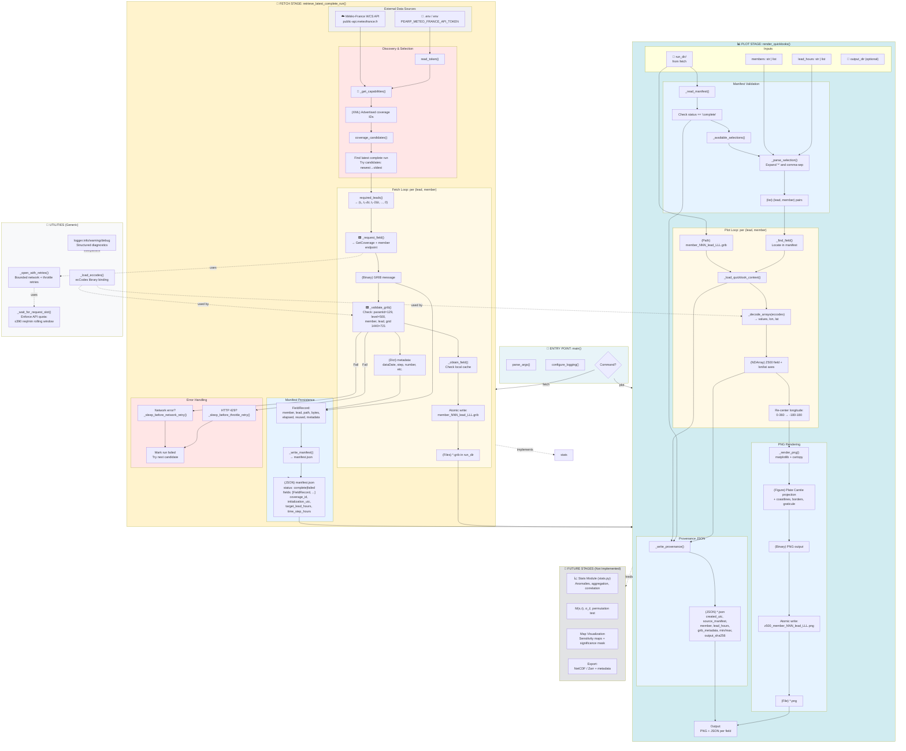

# Ensemble Sensitivity Pipeline: Code & Data Flow Diagram

This document contains the comprehensive pipeline flow diagram showing how data flows through the ensemble sensitivity analysis system, distinguishing case-specific pipeline functions from generic utilities.

## Architecture Overview

The pipeline has two main stages implemented in v0.1:
1. **Data Ingestion (fetch)**: WCS retrieval and validation of PEARP Z500 GRIB files
2. **Visualization (plot)**: Rendering single-member quicklooks from validated fields

Future stages (v1+):
- **Statistics**: Anomaly computation, target aggregation, correlation maps, permutation testing
- **Output**: Visualization and export of sensitivity maps

---

## Complete Nested Flow Diagram



---

## Data Flow Legend

### Node Shapes & Colors

- **🔵 Round (External)**: External API endpoints, user inputs
- **🟩 Square (Pipeline Step)**: Case-specific computation/validation for this analysis
- **📁 Folder**: Local directory or collection of files
- **📄 File types**: Explicit data artifacts (JSON, GRIB, PNG, XML)
- **📊 Utilities**: Generic helpers (logging, rate limiting, retries)
- **🔮 Future**: Not yet implemented; reserved for M2+ milestones

### Artifact Types

| Type | Notation | Example |
|------|----------|---------|
| External data | `☁️ ...` | API responses |
| Environment | `🔑 ...` | `.env`, tokens |
| Directory | `📁 ...` | `run_dir/`, `output_dir/` |
| GRIB binary | `(Binary)` | Members of `*.grib` |
| JSON manifest | `(JSON)` | `manifest.json`, `*.json` sidecars |
| Python objects | `(Dict), (List), (NDArray)` | In-memory structures |
| PNG image | `(Binary)` | `*.png` quicklook output |
| XML | `(XML)` | WCS capabilities document |

---

## Function & Module Hierarchy

### `src/ensemble_sensitivity/main.py`
- **`main(args)`**: Entry point dispatcher
  - Parses CLI arguments
  - Routes to `fetch` or `plot` subcommand
  - Configures logging

### `src/ensemble_sensitivity/wcs_retrieval.py`
**Case-specific pipeline stage: WCS catalog discovery & field retrieval**

#### Required: Discovery & Selection
- `read_token(env_file)` → API token from `.env` or environment
- `_get_capabilities(token)` → XML document from WCS server
- `coverage_candidates(capabilities)` → Sorted (coverage_id, init_time) tuples
- `required_leads(target, step)` → Tuple of lead hours in descending order

#### Required: Validation (scientific contract)
- `_validate_grib(body, eccodes, member, lead, init)` → metadata dict
  - Checks: paramId=129, level=500, 1440×721 grid
  - Members 0–34, lead_hours, units='m**2 s**-2'
  - Raises `RetrievalError` on mismatch

#### Required: Fetch & Cache
- `_request_field(token, coverage_id, member, lead)` → bytes
- `_obtain_field(candidate, member, lead, field_path)` → (bytes, metadata, reused)
  - Validates cache; re-fetches if invalid
- `_run_candidate(candidate)` → run_dir (Path)
  - Orchestrates the full fetch-and-validate loop for one run candidate

#### Required: Manifest & Traceability
- `_write_manifest(run_dir, manifest)` → atomic JSON write
- Manifest schema: status, coverage_id, initialization, leads, fields (with FieldRecord items)

#### Public API
- `retrieve_latest_complete_run(options)` → run_dir
  - Tries candidates newest-to-oldest
  - Returns first complete run
  - Raises `RetrievalError` if none found

#### Utilities (Generic)
- `_load_eccodes()` → ecCodes binding (with helpful error message)
- `_open_https(request)` → Pinned-host HTTPS only
- `_open_with_retries(request, context)` → Retried + rate-limited
- `_wait_for_request_slot(context)` → Rolling minute quota (390 req/min)
- `_sleep_before_throttle_retry(error, ...)` → Parse WCS 429 delay
- `_sleep_before_network_retry(error, ...)` → Exponential backoff

---

### `src/ensemble_sensitivity/visualization.py`
**Case-specific pipeline stage: Field decoding & quicklook rendering**

#### Required: Manifest Validation
- `_read_manifest(run_dir)` → dict
  - Must have status='complete'
- `_find_field(manifest, member, lead)` → field record dict
- `_available_selections(manifest)` → (members_tuple, leads_tuple)

#### Required: Selection Parsing (user input → validated list)
- `_parse_selection(value, candidates, label, min, max)` → tuple
  - Expands `'*'` and comma-separated lists
  - Validates against available
  - Rejects duplicates, out-of-range

#### Required: Field Loading & Coordinate Validation
- `_load_quicklook_context(run_dir, lead, member, output_path)` → _QuicklookContext
- `_decode_arrays(body, eccodes)` → (values, lon_axis, lat_axis)
  - Validates grid: 1440×721, 0.25°, regular_ll
  - Checks all values are finite
  - Recenters longitudes from [0°, 360°) to [−180°, 180°)

#### Required: Rendering (matplotlib + cartopy)
- `_render_png(context)` → writes atomic PNG
  - Equirectangular (Plate Carrée) projection
  - Coastlines, borders, graticule overlay
  - Title with run, lead, member

#### Required: Provenance Persistence
- `_write_provenance(context)` → writes atomic JSON sidecar
  - Records: manifest source, member, lead, grib metadata, min/max, PNG SHA-256

#### Public API
- `render_quicklooks(run_dir, lead_hours, members, output_dir, output_path)` → tuple[Path, ...]
  - Orchestrates all quicklooks
  - Single progress bar
  - Returns PNG paths in lead-major, member-minor order

---

### `src/ensemble_sensitivity/pipeline_checkpoint/pipeline_checkpoint.py`
**Generic utility module: best-effort checkpoint writing (currently unused)**
- Not part of current fetch/plot pipeline
- Reserved for future M2+ statistics stage observability

---

## Key Design Decisions

### 1. **Case-Specific vs. Generic Separation**

- **Case-Specific** 🟩: Functions whose logic depends on the PEARP/Z500/ensemble-sensitivity domain
  - `_validate_grib()`: Knows paramId=129, level=500, expects 35 members
  - `_decode_arrays()`: Knows 1440×721 0.25° grid, recenters for Plate Carrée
  - `_parse_selection()`: Interprets user lead/member selections
  - Aggregation, anomalies, correlation (future): Domain-specific statistics

- **Generic** 🔧: Reusable infrastructure, indifferent to the application
  - Rate limiting, retries, HTTP, XML parsing
  - File I/O, JSON marshalling
  - Logging, error recovery

### 2. **Atomicity & Traceability**

- Every GRIB and PNG write uses atomic rename (write `.tmp`, then replace)
- Manifest updated after every field, so partial failures are traceable
- Field records include: elapsed time, bytes, reused flag, full GRIB metadata
- No silent masking of errors; every stage can fail explicitly

### 3. **Lazy Computation**

- Fetch retrieves one field (one member, one lead) at a time
- Plot processes one (lead, member) pair per iteration
- No full-run array materialization until statistics (future)
- Memory O(1 field) instead of O(all fields)

### 4. **Rate-Limited API Access**

- Rolling 1-minute window, max 390 req/min (leaving 10 req/min margin)
- Per-request interval enforced even if window not full (smooth traffic)
- Explicit wait logging at INFO level
- Bounded retries (5 throttle, 2 network) with service-directed delay parsing

---

## File Structure

```
run_YYYYMMDDHH_tT_sS/
├── manifest.json                 ← Central traceability record
├── member_000_lead_000.grib       ← GRIB bytes for each (member, lead)
├── member_000_lead_024.grib
├── ...
├── member_034_lead_000.grib
└── maps/                          ← Quicklook outputs (optional)
    ├── z500_member_000_lead_000.png
    ├── z500_member_000_lead_000.json
    ├── z500_member_001_lead_024.png
    ├── z500_member_001_lead_024.json
    └── ...
```

### `manifest.json` Schema

```json
{
  "status": "complete|failed|in_progress",
  "coverage_id": "GEOPOTENTIAL__ISOBARIC_SURFACE___...",
  "initialization_utc": "2026-10-04T00:00:00+00:00",
  "target_lead_hours": 24,
  "time_step_hours": 24,
  "required_leads_hours": [24, 0],
  "members": [0, 1, ..., 34],
  "variable": "Z500",
  "units": "m**2 s**-2",
  "source": "Météo-France PE-ARPEGE WCS GLOB025",
  "fields": [
    {
      "member": 0,
      "lead_hours": 24,
      "relative_path": "member_000_lead_024.grib",
      "bytes_received": 2076662,
      "elapsed_seconds": 1.234,
      "reused": false,
      "grib_metadata": {
        "paramId": 129,
        "typeOfLevel": "isobaricInhPa",
        "level": 500,
        "dataDate": 20261004,
        "step": 24,
        "number": 0,
        "Ni": 1440,
        "Nj": 721,
        "units": "m**2 s**-2"
      }
    },
    ...
  ],
  "elapsed_seconds": 125.5,
  "bytes_received": 72836170,
  "failure": "member unavailable" // only if status == "failed"
}
```

---

## Future Stages (M2+): Stats & Sensitivity Maps

### Stats Module (`stats.py`)

**Case-specific pipeline stage: Ensemble sensitivity computation**

```python
def anomalies_ensemble(X: NDArray) -> NDArray:
    """X: (N, P) → X - mean(X, axis=0)"""

def target_aggregated(Z_target: NDArray, weights: NDArray) -> tuple[NDArray, float]:
    """Z_target: (N, K) → z_bar (N,), σ_z_bar scalar
    Standardize cells, weight by area, return aggregated target & cohesion."""

def sensitivity_map(X: NDArray, z_bar: NDArray, eps: float) -> NDArray:
    """X: (N, P) → M(s) = cov(z_bar, x) / σ_x
    Masked at points where σ_x < eps."""

def permutation_threshold(z_bar: NDArray, X: NDArray, B: int, seed: int) -> float:
    """Compute 95th percentile threshold via permutation test.
    B: # permutations, seed: for reproducibility."""
```

### Visualization Module (`visualization_maps.py`, future)

- Divergent colormaps (RdBu_r, symmetric bounds)
- Zone outline overlay
- Significance hatch/contour
- Multi-panel (one per lead)
- Title with σ_z_bar, run, t₁

### Export (`export.py`, future)

- NetCDF with CF conventions
- Zarr with Zarr metadata
- CSV tables of correlations by lead

---

## Testing Strategy

### Unit Tests (`tests/test_data_pipeline.py`)

- **Fetch**: Mock WCS API, validate GRIB checks, manifest consistency
- **Plot**: Mock GRIB decoding, coordinate recentering, selection parsing
- **Manifest**: JSON schema, atomic writes, resumption logic

### Integration Tests

- Full fetch→plot cycle with synthetic GRIB
- Round-trip: write PNG, read sidecar, verify SHA-256

### Data Quality Tests (future M4)

- Compare successive runs for robustness
- Permutation test: confirm 5% false-positive rate on noise

---

## References

- README.md sections 6 (Architecture) and 4 (Math definitions)
- Source code: `src/ensemble_sensitivity/*.py`
- Tests: `tests/test_main.py`, `test_data_pipeline.py`
- Data schema: Météo-France WCS GLOB025, ecCodes GRIB2 library
